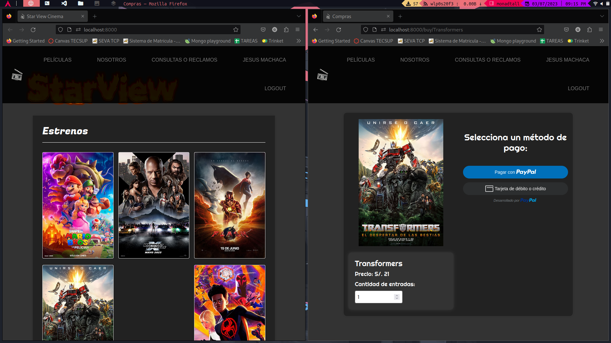

# *StarView Cinema*



### Project by:
* Machaca Hancco Jesus :boy:
* Moreno Villegas Royer :boy:
* Aguilar Vilca Carlos :boy:
* Beltran Torres Briguith :girl:
* Manzano Añamuro Jorge :boy:
  
## Description.
This project is an online platform where users can buy their tickets to see the most anticipated movie, A platform of combines two web frameworks (Laravel & Flask) to perform interesting things like building REST API.

# Main technologies : 

## [LARAVEL](https://laravel.com/) :pushpin:
**Laravel** was used to build the whole page, thanks to the **MVC** (Model View Controller) pattern, we managed to create **CRUD** operations, view and controllers to build a usable dynamic web page.

## [FLASK](https://flask.palletsprojects.com/en/2.3.x/) :pushpin:
**Flask** was used to build a **REST API** architecture hand in hand with Laravel. This with the objetive of handling transaccions and storing them in a nosql database, to later generate tickets that will be send to the user's email.


#  More Languages and Databases.

| **N°**       | **Technologie** | **Version** |
|--------------|:---------------:|------------:|
| 1            | Laravel (PHP)   | 10.10       |
| 2            | Flask (Python)  | 2.3.2       |
| 3            | MariaDB         | 10.11.4     |
| 4            | MongoDB         | 1.9.1       |
| 5            | JavaScript      | *           |
| 6            | HTML            | *           |
| 7            | CSS             | *           |
| 8            | Boostrap        | *           |

---

# Instalation :page_with_curl: .
## Note :warning: :
### The entire project was developed on Linux, so many of the commands will only work on Linux.

**First clone the repository.**

```bash
git clone https://github.com/JsasMachaca/StarView-Cinema.git
cd StarView\ Cinema
```

# Laravel Dependencies :heavy_check_mark: :
**To access directory**
```bash
cd Laravel
```
### Activate DATABASES (Linux).

**Activate MySql.**
```bash
systemctl start mariadb
```

**Activate MongoDB.**
```bash
systemctl mongodb
```

### Migrate and install dependencies.
***Before migrating the database, create the database beforehand with the following tables to prevent issues.***

first `mariadb -u your_user -p`

```sql
CREATE DATABASE CINEMA;
USE CINEMA;

CREATE TABLE EMPLEADOS (
	nombres VARCHAR(30),
	apelllidos VARCHAR(30),
	id_emp int(5) PRIMARY KEY,
	dni INT(8),
	sueldo DECIMAL(5,2),
	horas_trabajo INT(4),
	telefono INT(9)
);

CREATE TABLE MOVIES (
	titulo VARCHAR(100),
	info VARCHAR(500),
	duracion VARCHAR(8),
	precio DECIMAL(5,2),
	banner MEDIUMBLOB,
	taquilla VARCHAR(5),
	id INT(11) PRIMARY KEY
);
```

***Migrate databases and install depencencies.***

```bash
php artisan migrate
npm install
```

# Flask Dependencies :heavy_check_mark: :
**To access directory.**
```bash
cd Flask
```

### Create and activate vitual enviroment (Linux & Windows).
**In Linux:**
```bash
python -m venv venv
source venv/bin/activate
```

**In Windows:**
```bash
python -m venv venv
venv/Scripts/activate
```

**Install all dependencies.**
```bash
pip -r requirements.txt
```
# Activate all serves :heavy_check_mark: .

**Activate Laravel project.**
```bash
php artisan serve &
npm run dev &
```
**Activate Flask Project**
```bash
python main.py
```
---
